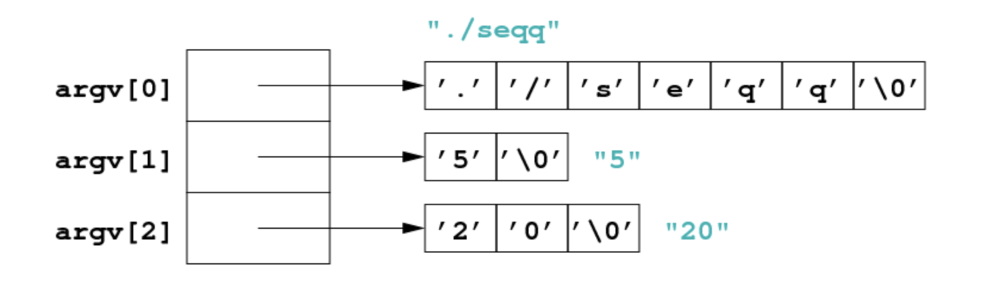
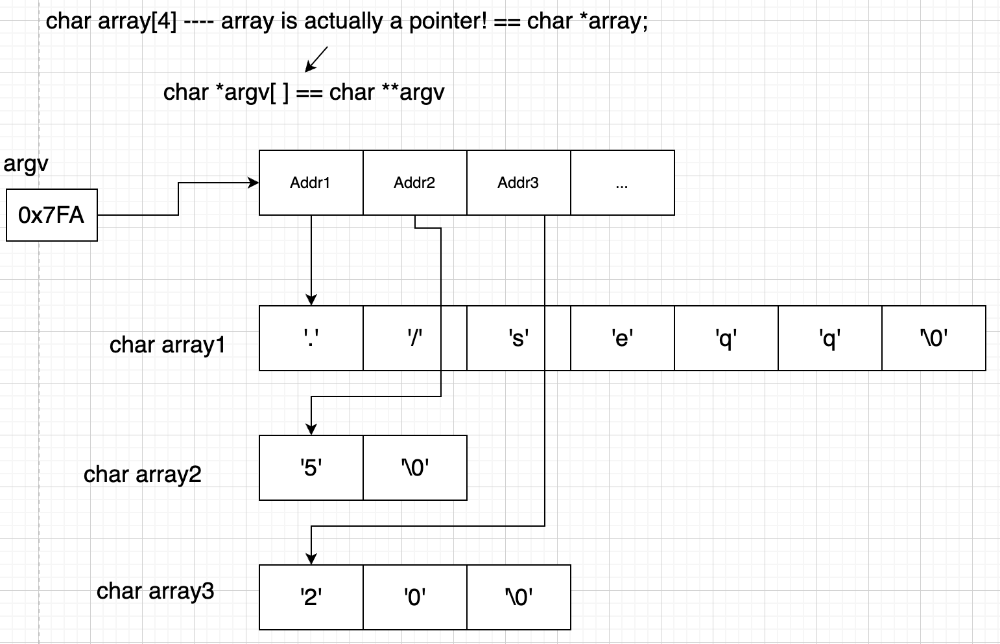

# Dynamic data structures

array vs link list 


P problem: n^2    ----  tracble ---- polynomial time

NP problem: e.g. exponential 2^n

### Numeral system

Binary: 0b1011

Hexidecimal:  0x3AF1     ----- memory

### Memory

```c
int k;
int m;

// Note the use of %p as placeholder for an address ("pointer" value)
printf("address of k is %p\n", &k);
printf("address of m is %p\n", &m);
```

### **Application: Input Using** `scanf()`

Standard I/O function `scanf()` requires the address of a variable as argument.

```c
// use %d to read an integer value
#include <stdio.h>
…
int answer;
printf("Enter your answer: ");
scanf("%d", &answer);
```

```c
//use %f to read a floating point value   (%lf for double)
float e;
printf("Enter e: ");
scanf("%f", &e);
```

Scanf() returns a value — the number of items read, use this value to determine if `scanf()` successfully read a number :

```c
int n;
printf("Enter a positive number: ");
// test if scanf successful and returns positive number
if (scanf("%d", &n) == 1 && (n > 0))   
	...
```


### Pointer

A pointer occupies space in memory, just like any other variable of a certain type.


Operator **`*`** is used to access the object the pointer points to:

```c
char c = "T";

// same job: dereference
int *p;    // this is how pointer are declared
char c;
p = &c;    // pointer p points to a char
*p = 'T';  // sets the value of c to 'T'

```

pass by value

```c
void swap(int a, int b) {
   int temp = a;                     // only local "copies" of a and b will swap
   a = b;
   b = temp;
}

int main(void) {
   int a = 5, b = 7;
   swap(a, b);
   printf("a = %d, b = %d\n", a, b); // a and b still have their original values
   return 0;
}

```

pass by address

```c
void swap(int *p, int *q) {
   int temp = *p;                  // change the actual values of a and b
   *p = *q;
   *q = temp;
}

int main(void) {
   int a = 5, b = 7;
   swap(&a, &b);
   printf("a = %d, b = %d\n", a, b);  // a and b now successfully swapped
   return 0;
}
```

### **Pointer Arithmetic**

char ---- 1byte; int ---- 4byte

```c
int a[6];   // assume array starts at address 0x1000
int *p;			// pointer is declared as type *p
p = &a[0];  // p contains 0x1000
p = p + 1;  // p now contains 0x1004, add the size of the type
```


### Array of strings(argv)






- Argc ---- argument count
  - `argc == 1` if no command-line arguments

- Argv ---- argment value

  - `argv[0]` always contains the program name

  - `argv[1],argv[2],…` are the command-line arguments if supplied

    

```c
int main(int argc, char *argv[]) { ...
// argc … stores the number of command-line arguments + 1
  
  ./seqq 10 20
```


- Atoi (ascii to int)

​		atoi(char *s)

- Atof (ascii to float)

   atof(char *s)